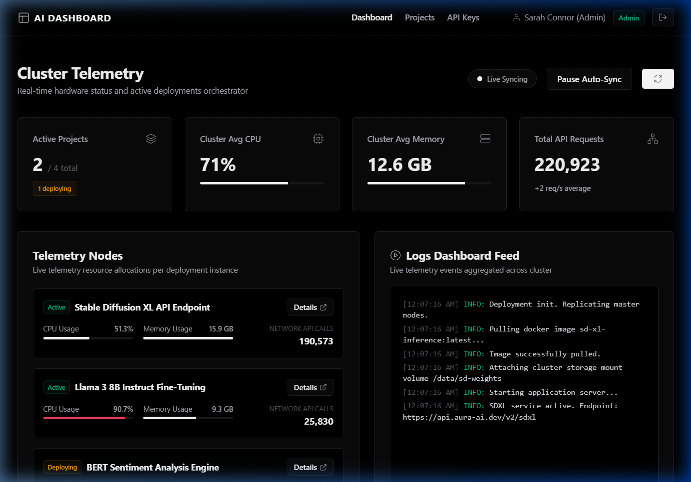
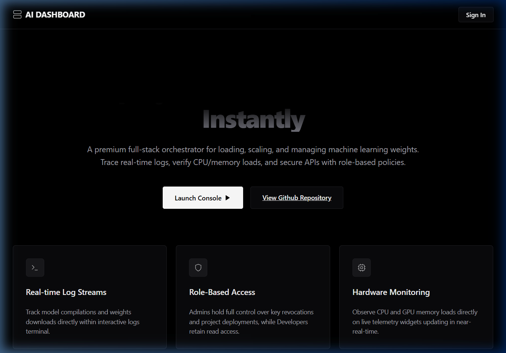
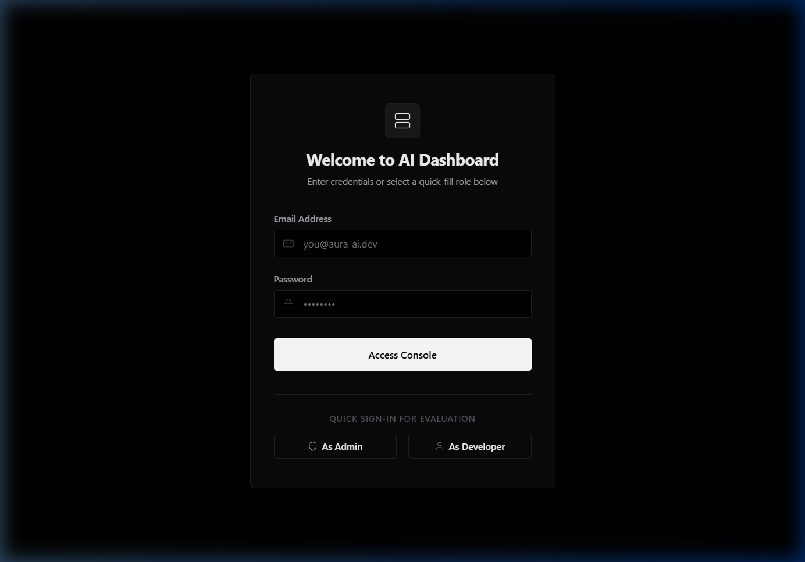
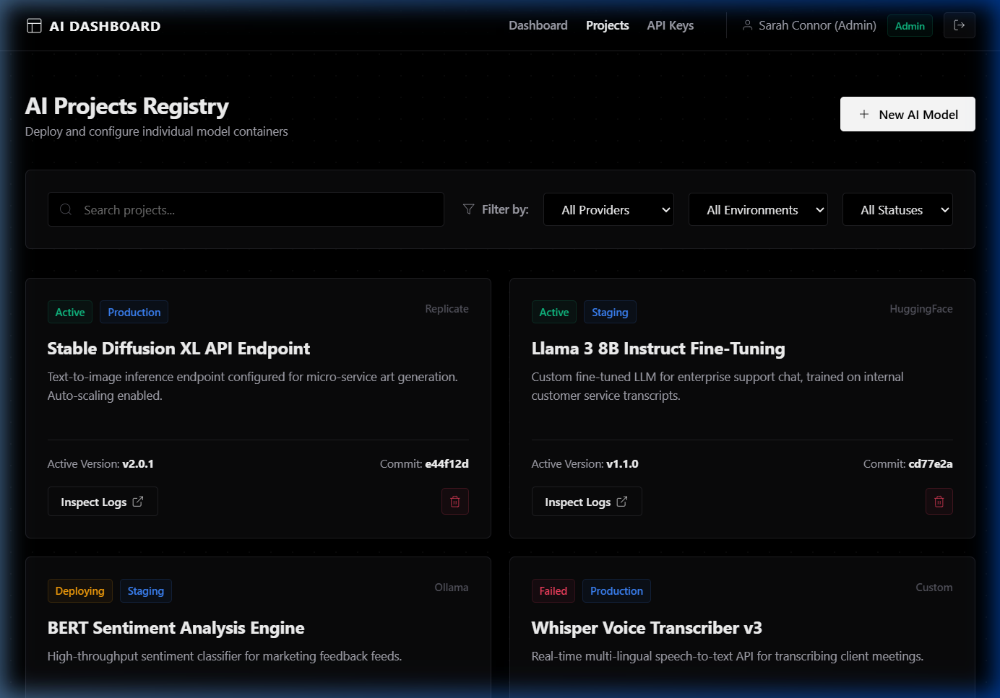
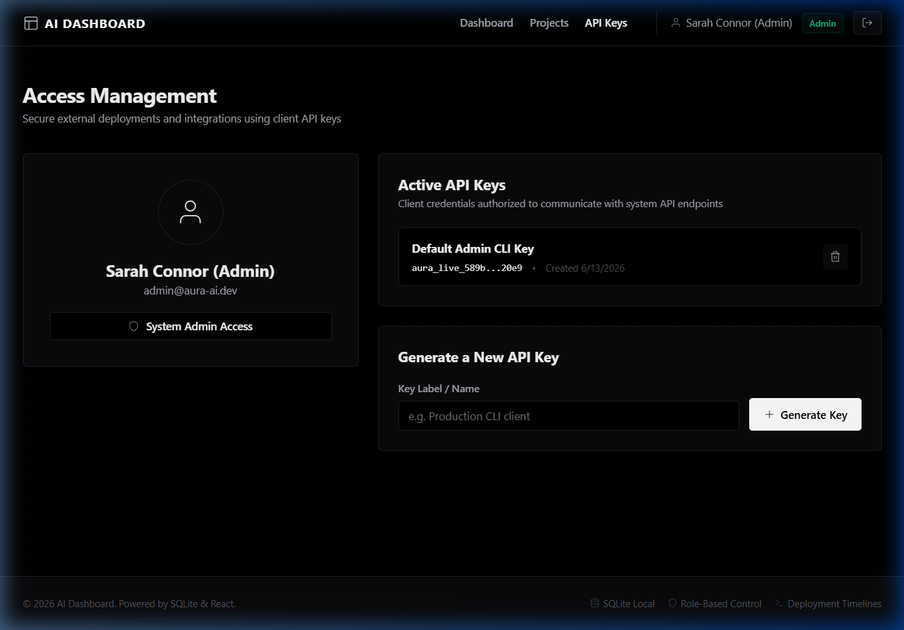

# AI Dashboard - Model Deployment Hub

A premium, full-stack deployment dashboard designed for managing and monitoring machine learning model instances. This application features telemetry tracking, interactive terminal log streams, credential keys control, and role-based permissions (RBAC).

---

## 📷 Screenshots

### 🖥️ Dashboard Console


### 🚀 Landing Screen


### 🔐 Login Portal


### 📁 Project Management


### 👤 Developer Profile & API Keys


---

## 🛠️ Architecture & Tech Stack

The application is structured as a light monorepo separating front-end interface and back-end service layers.

*   **Frontend**: React (Vite single page app) styled with native CSS variables for responsive grid layouts, subtle dot grid graphics, and smooth transition states. Utilizes **custom native SVG components** styled via vanilla CSS (completely removing external package dependencies like `lucide-react`).
*   **Backend**: Node.js/Express API utilizing ESM (`import/export`) modules, structured routes, and request validation middleware.
*   **Database & ORM**: SQLite database managed via Prisma ORM for fully typed queries and auto-injected schema migrations.
*   **Containerization**: Docker Compose configured for orchestrating frontend React and backend Express servers with volume mounts.

---

## 🚀 Setup & Installation

You can run the application either **locally on your host machine** or containerized using **Docker Compose**.

### Option A: Local Run (Recommended for rapid testing)

#### Prerequisites
*   Node.js (v18.0.0 or higher)
*   npm (v9.0.0 or higher)

#### Step-by-Step Launch
1.  **Clone the repository** and navigate to the project root.
2.  **Bootstrap dependencies**:
    ```bash
    npm run bootstrap
    ```
    *This will install packages across the root, `client/` and `server/` directories.*

3.  **Initialize the Database**:
    ```bash
    npm run db:setup
    ```
    *This triggers Prisma schema synchronization to generate a local SQLite database (`server/prisma/dev.db`).*

4.  **Seed Mock Analytics & Logs**:
    ```bash
    npm run db:seed
    ```
    *Pre-populates the database with default login credentials, active AI projects, deployment logs timeline, and user API keys.*

5.  **Start Development Servers**:
    ```bash
    npm run dev
    ```
    *This uses the `concurrently` package to launch the Vite dev server on `http://localhost:5173` and the Express server on `http://localhost:5000` simultaneously.*

---

### Option B: Docker Compose

If you have Docker installed, you can launch the complete stack with a single command:

```bash
docker-compose up --build
```

*   **Frontend Console**: Accessible at `http://localhost:5173`
*   **Backend Express Server**: Accessible at `http://localhost:5000`

---

### Option C: Cloud Deployment (Render Blueprint)

This project contains a declarative `render.yaml` configuration for automated one-click deployments on **Render**:

1. Log in to the [Render Dashboard](https://dashboard.render.com/).
2. Click **New > Blueprint** (or click the **Blueprints** tab).
3. Connect and select your GitHub repository.
4. Render will automatically parse the `render.yaml` template, configure the environment, install and build production assets, and run the unified full-stack service.
5. The app will be live on a secure HTTPS endpoint (serving both frontend UI and backend API routes).

---

## 🔐 Evaluation Credentials

For evaluating the **Role-Based Access Control (RBAC)** features, use the quick-fill credential helpers on the login page or manually enter:

| Role | Email | Password | Allowed Actions |
|---|---|---|---|
| **Admin** | `admin@dashboard-ai.dev` | `admin123` | Inspect logs, create/delete projects, trigger redeployments, manage API keys. |
| **Developer** | `dev@dashboard-ai.dev` | `dev123` | Inspect logs, view project configurations, edit environment variables (Read-Only on builds/keys). |

---

## 📝 Assumptions & Limitations

1.  **SQLite Storage**: SQLite was selected as the database driver. This allows the application to run out-of-the-box with zero database configuration or external cloud dependencies required from the evaluator. For a production deployment, this can be swapped to PostgreSQL in `schema.prisma` in seconds.
2.  **Mock Deployment Telemetry**: The redeployment process simulates authentic logs (CUDA loading, image pulling, shape padding checks) over a ~10-second timeline. Metrics fluctuate dynamically in the background every 5 seconds to represent real-time cluster workloads.
3.  **Single-Time Key Visibility**: In alignment with modern security practices, API keys display their plaintext token only once immediately after generation. Subsequent views only display masked hints.
4.  **Local SVG Icons & Vanilla CSS Theme**: Replaced the external `lucide-react` icon framework with custom local SVG wrapper components to minimize bundle footprint and dependencies. Overhauled the application theme to a premium dark monochrome layout to fit high-end developer console styling requirements.
